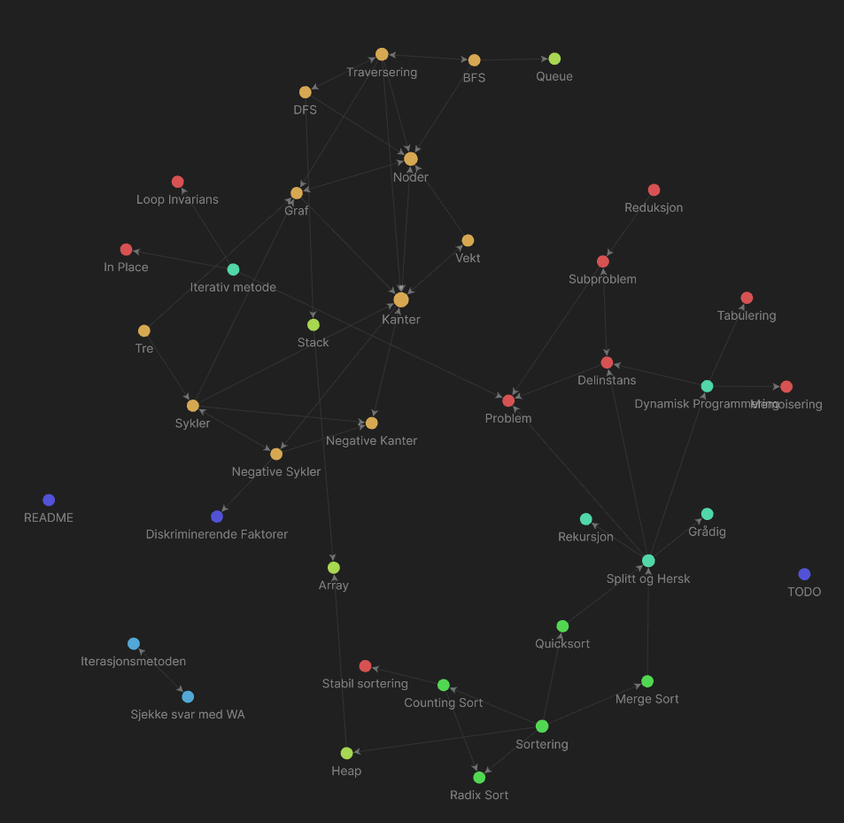
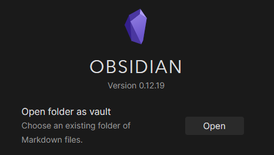
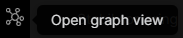
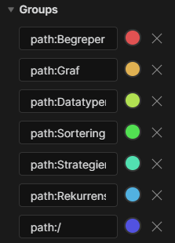

AlgDat stuff, på grunn av bruken av backlinks, kan det være best å lese i [Obsidian](https://obsidian.md/)
Linker funker dessverre ikke i [andre lesere](https://www.youtube.com/watch?v=dQw4w9WgXcQ&ab_channel=RickAstley).

## Hvorfor i Obsidian?
Fordi det er lett å se hvilke deler av pensum som henger sammen

## Hvordan bruke?
Last ned [Obsidian](https://obsidian.md/) og klon dette repoet.

Åpne så repoet i obsidian

For å få opp grafen trykker du på `Open Graph View` knappen i venstre marg

Graph View har mange instillinger for visning, her er det bare å leke seg frem. Blant annent er det mulig å fargelegge noder basert på kriterier
