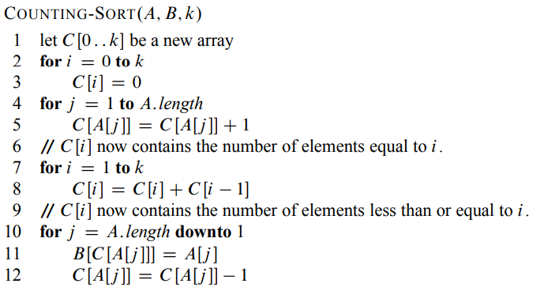

# Sortering

* [Raske sorteringer](#raske-sortering)

## Viktige huskerregler

En sammenlikningsbasert kan IKKE kjøre raskere enn O(n lg n).

Bevis:
```
En liste med n elementer kan permuteres på n! måter.
Dermed må antall sammenlikninger m være 2^m>=n!.
Da får du m = n lg n - n.
Asymtotisk m = theta n lg n
```


## Tabell


## Raske sorteringer

### Counting sort
Kjøretid: O(n+k)



Atributter:
* Stabil
* Brukes ofte med [radix sort](#radix-sort)

### Radix sort
Kjøretid: O(d(n+k))


Attributter:
- Brukes til å sortere strenger
- Brukes til å sortere integer fra 0 til n^k-1 i O(n) tid
	- Konverter alle til base n og radix sorter listen