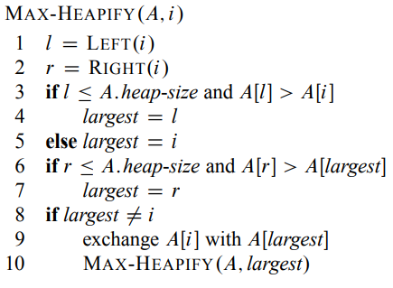
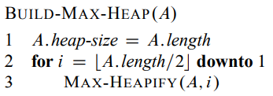

# Heaps
En heap er et array objekt som kan ses på som et nesten komplett
binærtre. Viktig med et heap er at A[parent(i)] >= A[i].
Dette kan sikres med med [MAX HEAPIFY](##-MAX-HEAPIFY) som sørger for
at at noden den kjøres på blir på riktig sted.
Skal en vilkårlig liste gjøres til en heap brukes [build max heap](##-BUILD-MAX-HEAP)

## MAX HEAPIFY
Kjøretid: O(lg n)

## BUILD MAX HEAP
Kjøretid: O(n)

