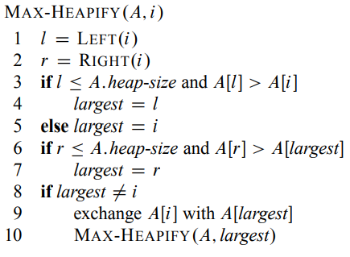
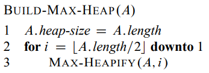
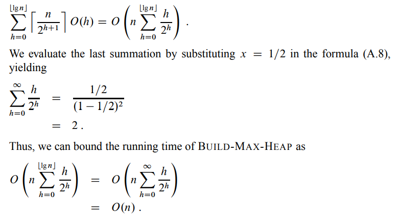
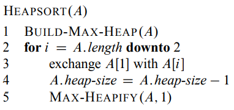
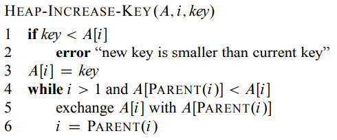
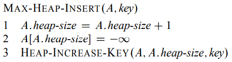

# Heaps
En heap er et [[Array | array]] objekt som kan ses på som et nesten komplett
binærtre. Viktig med et heap er at A[parent(i)] >= A[i].
Dette kan sikres med med [[#MAX HEAPIFY | MAX HEAPIFY]] som sørger for
at at noden den kjøres på blir på riktig sted.
Skal en vilkårlig liste gjøres til en heap brukes [[heap#BUILD MAX HEAP | BUILD MAX HEAP]].
Sortering i heap er [HEAPSORT](#heapsort).

[heap increase key](#heap-increase-key)

[max heap insert](#max-heap-insert)

## MAX HEAPIFY
Kjøretid: O(lg n)

## BUILD MAX HEAP
Kjøretid: O(n)

Bevis:

## HEAPSORT
Kjøretid: O(n lg n)

## HEAP INCREASE KEY
Kjøretid: O(lg n)

## MAX HEAP INSERT
Kjøretid: O(lg n)

